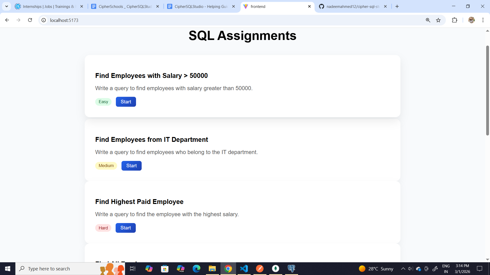
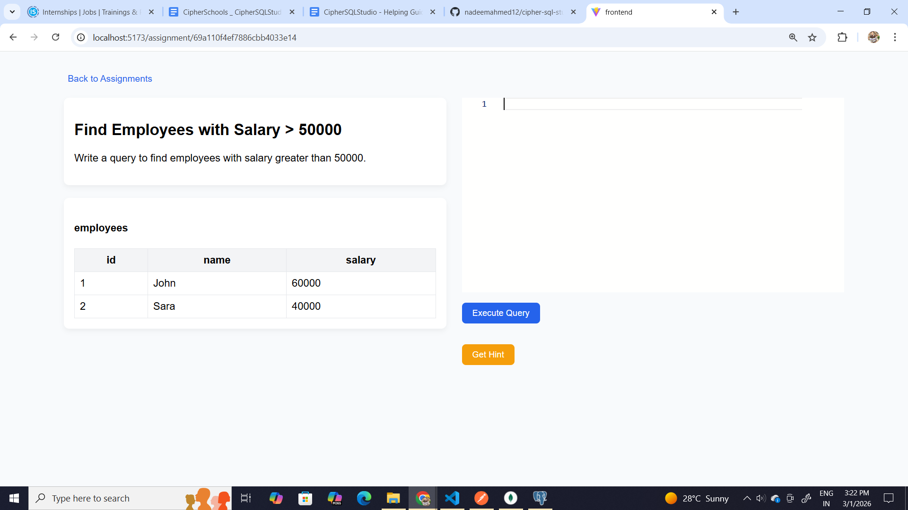
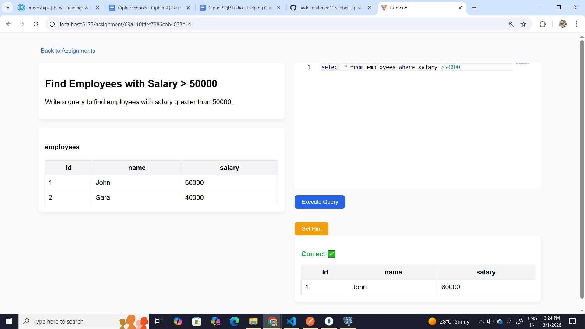
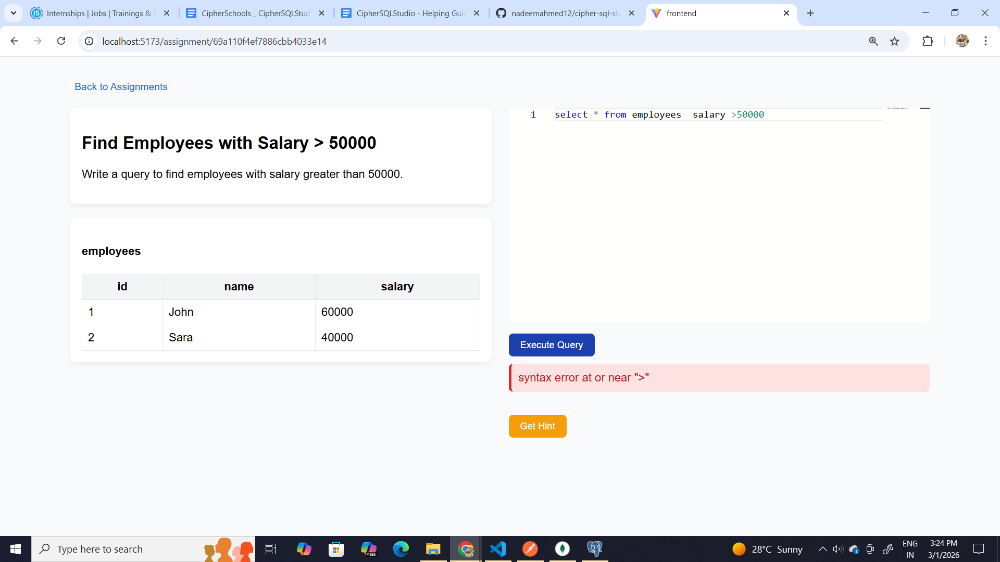
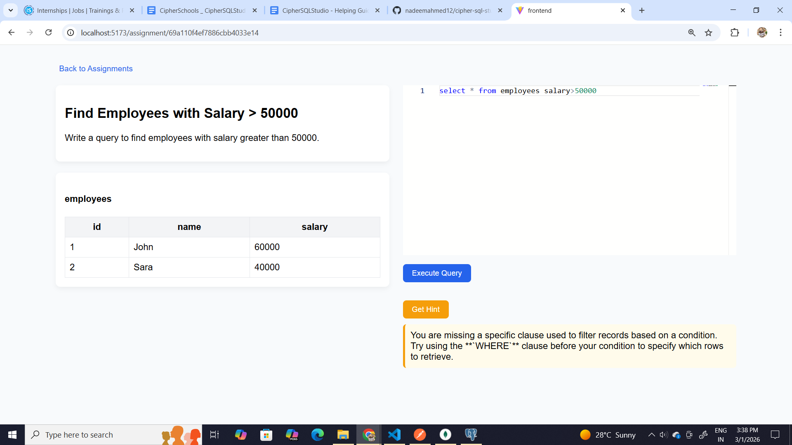
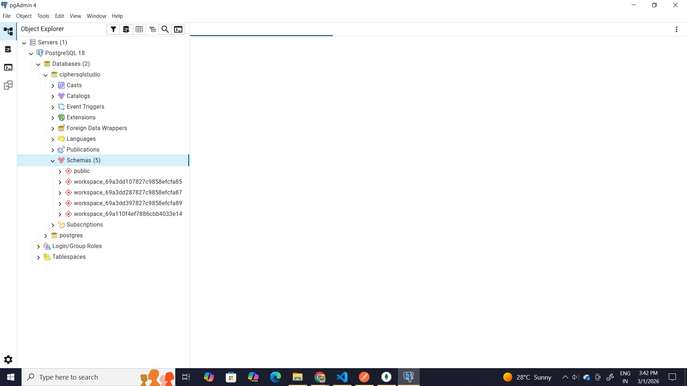
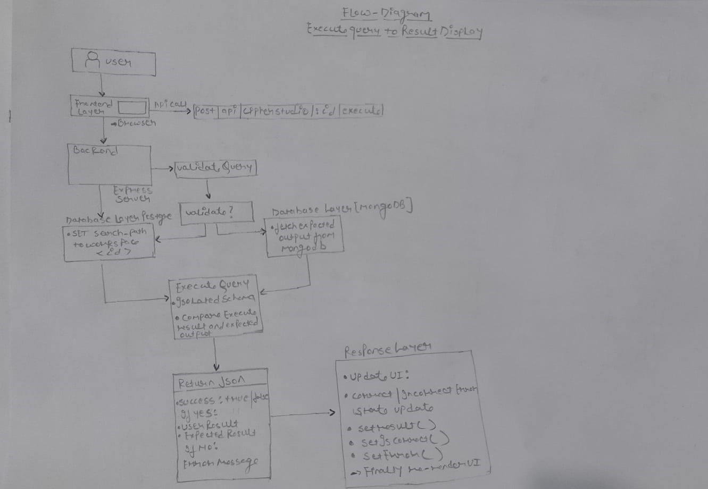

# CipherSQLStudio

A Full Stack SQL Learning Platform with isolated schema execution and AI-based hints.

---

##  Features

- Assignment listing
- Real-time SQL execution
- PostgreSQL schema isolation
- Query validation & security
- AI-powered hint system
- Responsive UI (mobile-first)

---

## 🛠 Tech Stack

### Frontend
- React
- React Router
- SCSS
- Monaco Editor

### Backend
- Node.js
- Express
- PostgreSQL
- MongoDB
- Gemini API

## ⚙️ Setup

### Backend
- cd backend  
- npm install  
- node server.js or nodemon server.js 

### Frontend
- cd frontend  
- npm install  
- npm run dev  

---
## For detailed setup and architecture:
- /backend/README.md
- /frontend/README.md

## 📸 Demo Screenshots

### Assignment Listing

### Attempt Interface

### Correct Result Validation

### Error Handling

### AI Hint System

### Isolated Workspace (PostgreSQL Schema)

### Flow Diagram execute query to result display
